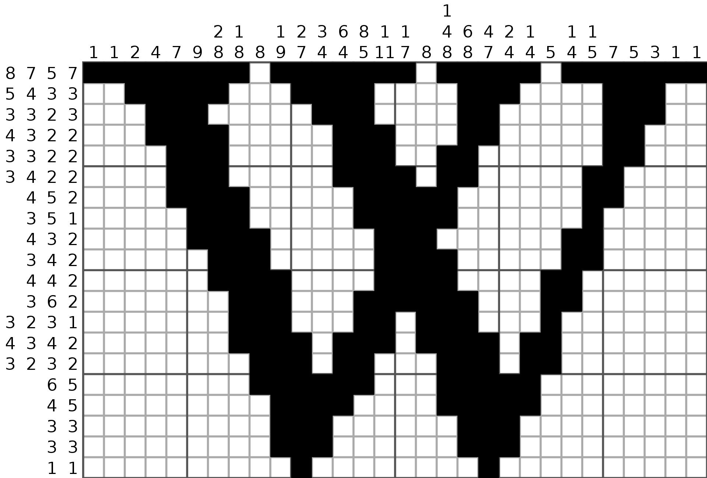
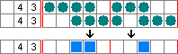

# Summary
We implemented a GPU-accelerated parallel nonogram solver that can find solutions for puzzles that require lookahead solving. We found that a sequential implementation is faster for the largest puzzles that humans typically solve (99x99), but that for larger puzzles a parallel implementation has better performance.

<!--
#TODOs:
 - Describe actual performance results here.
-->

# Background
Nonograms are logic puzzles built around a rectangular grid divided into cells. The solver's objective is to determine, for each cell, whether the cell is shaded or not. The constraints on the shading of cells are given as number sequences on each row and column, indicating to the solver the number of contiguous regions of shaded cells in that line (row or column) and the number of shaded cells in each contiguous region. An example is shown below:

## Data structures
The state of the cells of a nonogram can be represented by a matrix or board whose elements can take one of three different values: white (unfilled), black (filled), or unknown. For each row and column there is an associated set of constraints, which can be represented as a list of numbers.

Note that while the goal is a board with no unknowns that satisfies the associated constraints, it is possible that a particular board will contradict its constraints or be in such a state that a contradiction is implied in the future. This will be explained in more detail below.

## Operations
Solving nonograms is an iterative process. Any given cell being determined means that other cells in its row and column can also possibly be determined with the new information. There are two basic kinds of operations involved in solving nonograms: simple solving, and lookahead solving. 

### Simple solving
One key operation involved in solving nonograms is advancing the state of any particular row or column, which will just be referred to as a line. Given a line and its list of constraints, a simple solve operation will (potentially) be able to change at least one unknown cell to either filled or unfilled. There are a variety of algorithms that can accomplish this, the simplest of which is illustrated below:

In this example, consider a single line with runs of length four and three. By examining the both the leftmost and rightmost arrangements of the runs, it is apparent that in all cases the cells marked in blue will be filled. In this case, it is not also uaranteed that the cells in white are unfilled; those cells will still be unknown. However, if the first column of the puzzle is solved and it is determined that the first cell of the row is filled, then there is enough information to completely solve the row.

Note that many nonograms can be solved by iterated simple solving. By repeatedly alternating between applying simple solvers to the rows, and to the columns, more and more cells will be determined until eventually the entire puzzle is solved.

This iterated simple solving method can be thought of as a single step in which a board is reduced to its most solved form (fewest unknown cells).

### Lookahead solving

For some puzzles, applying simple solving alone is not enough to find a solution. It is possible to get to a state where no additional cells can be determined from the known information. In this case, it is necessary to make a guess about an unknown cell. The process is relatively simple: a guess is made, and then the board is solved with the guess assumed to be true. There are then three possibilities:

1) A valid solution is found, in which case the guess was correct.
2) A contradiction is found, meaning the guess was incorrect.
3) The board is again unable to advance, meaning another guess must be made.

It is clear that lookahead solving is a traditional backtracking algorithm. As with any backtracking problem, the cell and value of the guess is irrelevant to eventually finding a solution—eventually a solution will be found. However, to maximize performance various heuristics can be used to make a guess that is either likely to be correct, or likely to arrive at a contraction quickly, or both.

Note that lookahead solving does affect the correctness of a board while simple solving does not. We consider a board to be correct if there exists some way to fill in all of its unknown cells such that the constraints are satisfied. It is possible for a board to be incorrect and unsolved: this is a board that is eventually guaranteed to have a contradiction after it is solved more. However a board can only become incorrect through guessing. Solving a puzzle starts with the board full of unknowns which is trivially correct.

## Inputs and outputs

The input to the algorithm is the set of constraints. The board starts in an entirely unknown state.

The output of the algorithm is a board in which every cell is either filled or unfilled, that also satisfies all of the constraints given in the input

## Computational expense
Typically nonograms are meant to be solved by humans. This means that they tend to have relatively low problem sizes. There are two main parameters involved in determining the total size of the problem: number of constraints per line, and size in rows/columns.

Typically puzzles will have on the order of 10 or fewer constraints per line. Because many nonograms form basic images, lines with fewer constraints are more frequent. Puzzles will also be relatively small in grid size. The largest ones are on the order of 100x100, meaning there are only 200 total lines.

This tendency to have small puzzles means that any results need to be contextualized. When solving a puzzle meant for humans it's likely that the overhead of any parallelism will dominate.

### Simple solving
Simple solving techniques are relatively expensive individually. They involve iteratively working through the possibilities for a given line until unknown cells can be filled in. The amount of work involved in this process increases as the number of runs in a given line increases, or as the length of the line increases.

In total the simple solving techniques are also expensive because they must be repeatedly applied to every row of the board, as well as every column. As the board grows the expense of running all the solvers increases.

### Lookahead solving
The process of lookahead solving outside of simple solving is not computationally expensive. If heuristics are used they can be be more expensive depending on which algorithm is chosen.

## Workload
The workload for solving a puzzle consists of iterated simple solving and lookahead solving. Within simple solving there are dependencies between the row steps and column steps.

### Parallelism
Simple solving techniques are applied to a single line (row or column) at a time. They read only the constraints for that line, as well as the contents of the cells in the line, and they write only to cells in the line. Thus simple solving on either every row or every cell can be done in parallel both computationally, and data-wise. 

Because the results from solving the rows are necessary for solving the columns and vice versa, solving rows and columns in parallel is possible but could potentially waste compute resources.

### Locality
There is spatial locality as the simple solver will need to iterate over the lines. When the lines are rows this allows us to exploit cache locality, and storing the board in a column major format can allow us to potentially use the same locality for the columns.

### SIMD
Depending on how simple solvers are implemented it is possible that SIMD execution could speed up the simple solvers. In particular, a solution that is largely branchless would be able to take advantage of SIMD. This technique would also likely lend itself well to GPU/CUDA execution because of both the SIMD possibilities and the fact that each computation requires very little data, reducing communication overhead.

# Approach

The solver was broken down into the components described in the background section. The goal was to pick a set of technologies that fit the problem and our proposed solution best, and then to tune the specific algorithms and data structures.

## Technologies
A number of technologies were considered, however eventually GPUs/CUDA were selected as the platform for the solver. There were a few primary reasons for this decision.

One was that the computations involved in solving nonograms are not memory-intensive. As mentioned above, for any given board the constraints need to be stored, as well as the actual state of the board. For a board with a reasonable number of constraints per line (on the order of 10) that has N rows and M columns, the amount of memory required is O(NM) with a relatively small constant that are implementation dependent. In particular, this means that shared block memory is large enough to hold the state of a board.

In addition to having a memory model that maps well to solving nonograms, CUDA's computation model is also a good fit. A large number of threads (1024) can fit into a thread block, meaning each individual line solver can run in parallel even for larger puzzles, and they can all share the same block memory.

Worth noting again is that a lot of these benefits exist for puzzles ranging from very small (10x10) to a few times larger than humans typically solve (400x400). As puzzles get larger they outgrow shared block memory into global memory, which incurs a performance penalty. At a certain size the number of threads will exceed the maximum for a block as well.

There were also some downsides to using CUDA that were discussed in the decision process. One is that its SIMD capabilities went unused, because the simple solvers running in parallel diverge too much. Another is that it would be difficult to test very large problem sizes because the Gates machines only have a single GPU each.

Another option that was considered was the Xeon Phi machines, because they would better handle divergent execution, however it was ultimately decided that having the higher number of CUDA threads would be more beneficial.

## Problem mapping
The problem maps onto a GPU roughly as described in the above section. There are two regions of shared block memory that hold the entire board, one in row-major format and one in column-major format. Additionally, there is a region of shared block memory for the individual line solvers to hold their data. When the simple solvers run they are all mapped along one dimension of the same block.

In addition, there are parts of the solving algorithm, particularly the lookahead solving, as well as memory operations that need to only run once. These are run from the first thread (chosen arbitrarily).

A goal when the solution was developed was that as much of the solver run on the GPU as possible. A significant portion of overhead from using CUDA comes from copying memory back and forth between the host and the device. Rather than do that, or create a number of additional kernels to perform specific operations on the data, the majority of the algorithm runs as a single kernel.

No big changes were necessarily needed to enable better mapping to the parallel resources. The most parallelizable element of the system, the simple solvers, ran independent of each other in the sequential implementation already.

## Optimization iterations
There were a few important optimizations that were arrived at by iterating. One was running both the row and column solvers at the same time. Because the line solvers were written to be independent, they were eventually modified so that they only time they wrote data to the board in shared block memory was when they had a new value to write.

Additionally, the fact that every value being written is guaranteed to be correct also means that there is no synchronization necessary if/when multiple solvers write to the same cell. They will either write the same value in which case the value will be written one way or another, or they'll write different values. If they write different values then the board must have been incorrect, in which case there will be a contradiction no matter which value ended up actually getting written.

Another interesting optimization that was mentioned above was storing two copies of the board data, one in row-major and one in col-major format. It was inspired by the assignments during the semester where such a strategy was a way to improve locality and therefore cache-friendliness of the data.

In this case, it works particularly well because each line solver reads and writes only its particular line data. Additionally, writes are much less frequent because they only occur when correct values have been found. Compounding that is the fact there is often dependence between row solving and column solving.

Consider the case where no new cells can be solved by the row solvers, but some can be by the column solvers, and both run at the same time. Then only the column solvers will update the board. On the next iteration, only the row solvers (if any) will update the board, and so on. This dependence means that while it's possible for the solvers to all run in parallel, the actual benefits are relatively minimal.